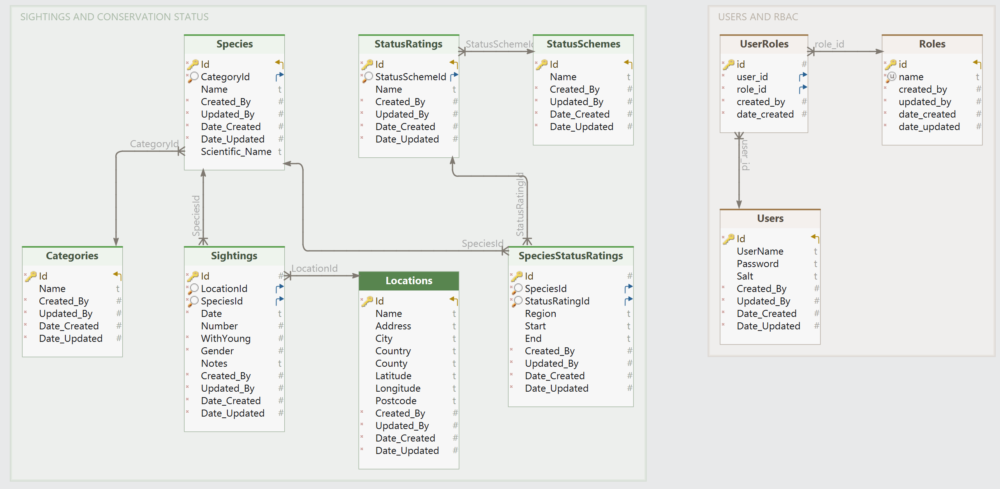

Database Schema
===============

The Nature Recorder application has a SQLite back-end with the following schema:

+-----------------------+---------------------------------------------------------------------------------------+
| Table                  | Comments                                                                             |
+-----------------------+---------------------------------------------------------------------------------------+
| LOCATIONS             | List of locations for which sightings can be recorded                                 |
+-----------------------+---------------------------------------------------------------------------------------+
| CATEGORIES            | Top level categories for species e.g. birds, mammals, insects                         |
+-----------------------+---------------------------------------------------------------------------------------+
| SPECIES               | Individual species                                                                    |
+-----------------------+---------------------------------------------------------------------------------------+
| SIGHTINGS             | Sighting records for a species at a location on a date                                |
+-----------------------+---------------------------------------------------------------------------------------+
| STATUSSCHEMES         | Conservation status rating schemes                                                    |
+-----------------------+---------------------------------------------------------------------------------------+
| STATUSRATINGS         | Conservation status ratings, each associated with a status rating scheme              |
+-----------------------+---------------------------------------------------------------------------------------+
| SPECIESSTATUSRATINGS  | Conservation status for a species on a scheme, with effective dates for the rating    |
+-----------------------+---------------------------------------------------------------------------------------+
| USERS                 | Not used by the Python version of the application                                     |
+-----------------------+---------------------------------------------------------------------------------------+
| __EFMigrationsHistory | Not used by the Python version of the application                                     |
+-----------------------+---------------------------------------------------------------------------------------+
